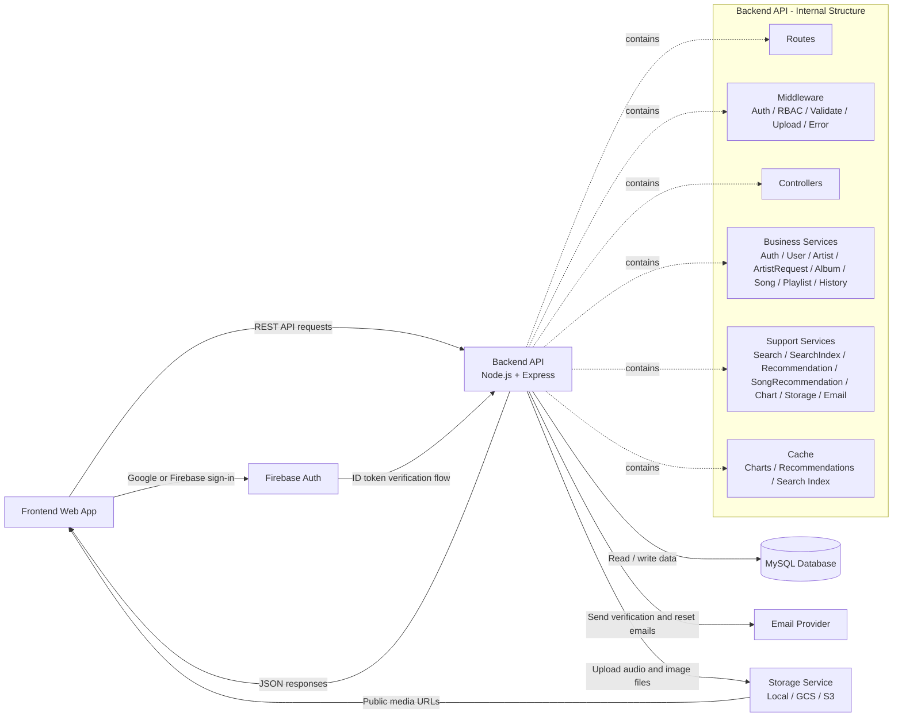

# Miro Prompt + Checklist - Diagram 01

## 1. Diagram duoc lam truoc

`Diagram 01` = `Bieu do khoi tong the he thong`

Day la bieu do nen lam dau tien vi no giup:

- dinh vi toan bo he thong truoc khi ve UC, activity, sequence
- cho thay ranh gioi giua frontend, backend, database va cac he thong ngoai
- giup cac bieu do sau nhat quan hon

## 2. Muc tieu cua diagram

Can the hien duoc:

- Frontend goi REST API toi Backend
- Backend xac thuc bang JWT hoac Firebase ID token
- Backend doc/ghi du lieu vao MySQL
- Backend gui email qua Email Provider
- Backend upload media qua Storage Service
- Backend nhan/xac minh Firebase token khi login Google/Firebase

## 3. Prompt de dan thang vao Miro

Khuyen nghi dung prompt tieng Anh de Miro AI ra cau truc dep va on dinh hon.

```text
Create a clean, professional high-level system block diagram for a music streaming platform backend.

The diagram must show these main blocks:
1. Frontend Web App
2. Backend API (Node.js + Express)
3. MySQL Database
4. Firebase Auth
5. Email Provider
6. Storage Service

Inside the Backend API block, show these internal modules as grouped sub-blocks:
- Routes
- Middleware: Auth Middleware, RBAC Middleware, Validation Middleware, Upload Middleware, Error Middleware
- Controllers
- Business Services: Auth Service, User Service, Artist Service, Artist Request Service, Album Service, Song Service, Playlist Service, History Service
- Support Services: Search Service, Search Index Service, Recommendation Service, Song Recommendation Service, Chart Service, Storage Service, Email Service
- Cache: Chart Cache, Recommendation Cache, Search Index Cache

Show these interactions with directional arrows and short labels:
- Frontend Web App -> Backend API: REST API requests
- Backend API -> Frontend Web App: JSON responses
- Frontend Web App -> Firebase Auth: Google/Firebase sign-in
- Firebase Auth -> Backend API: Firebase ID token verification flow
- Backend API -> MySQL Database: read/write business data
- Backend API -> Email Provider: send verification and password reset emails
- Backend API -> Storage Service: upload audio and image files
- Storage Service -> Frontend Web App: public media URLs

Add small notes near the Backend API block:
- Authentication: JWT access token + refresh token
- Roles: USER, ARTIST, ADMIN
- Main domains: auth, users, artists, artist requests, albums, songs, playlists, search, charts, recommendations, admin, trash

Visual requirements:
- Use a modern architecture/block diagram style
- Put Frontend on the left, Backend in the center, Database and external services on the right
- Group external systems clearly
- Use clear titles and neat spacing
- Keep it suitable for a software engineering report or graduation thesis
```

## 4. Ban prompt ngan hon neu Miro tra ket qua qua ram

```text
Create a high-level system architecture block diagram for a music streaming application.

Blocks:
- Frontend Web App
- Backend API (Node.js + Express)
- MySQL Database
- Firebase Auth
- Email Provider
- Storage Service

Inside Backend API include:
- Routes
- Middleware
- Controllers
- Business Services
- Support Services
- Cache

Arrows:
- Frontend <-> Backend: REST API / JSON
- Frontend -> Firebase Auth: Google sign-in
- Backend -> MySQL: read/write data
- Backend -> Email Provider: verification and reset emails
- Backend -> Storage Service: upload audio and images
- Storage Service -> Frontend: public file URLs
- Firebase Auth -> Backend: token verification

Notes:
- JWT + refresh token
- Roles: USER, ARTIST, ADMIN
```

## 5. Ban nhap de doi chieu khi Miro sinh diagram

Ban co the dung phan nay de kiem tra xem Miro co sinh dung logic khong.



## 6. Checklist de duyet Diagram 01

Sau khi Miro sinh diagram, check tung muc sau:

- [ ] Co du 6 khoi chinh: Frontend, Backend API, MySQL, Firebase Auth, Email Provider, Storage Service
- [ ] Backend nam o trung tam so do
- [ ] Frontend nam ben trai
- [ ] Database va external systems nam ben phai
- [ ] Co mui ten Frontend -> Backend va Backend -> Frontend
- [ ] Co mui ten Frontend -> Firebase Auth
- [ ] Co mui ten Firebase Auth -> Backend
- [ ] Co mui ten Backend -> MySQL
- [ ] Co mui ten Backend -> Email Provider
- [ ] Co mui ten Backend -> Storage Service
- [ ] Co mui ten Storage Service -> Frontend
- [ ] Ben trong Backend co nhom Routes
- [ ] Ben trong Backend co nhom Middleware
- [ ] Ben trong Backend co nhom Controllers
- [ ] Ben trong Backend co nhom Business Services
- [ ] Ben trong Backend co nhom Support Services
- [ ] Ben trong Backend co nhom Cache
- [ ] Co note ve JWT access token va refresh token
- [ ] Co note ve roles: USER, ARTIST, ADMIN
- [ ] Co note ve cac domain chinh: auth, users, artists, artist requests, albums, songs, playlists, search, charts, recommendations, admin, trash
- [ ] So do khong qua roi, khong lap lai ten khoi
- [ ] Ten khoi va label mui ten ngan, ro, de doc
- [ ] Tong the nhin giong architecture diagram chuyen nghiep, phu hop bao cao

## 7. Cach chinh tay sau khi Miro sinh xong

Neu Miro sinh chua dung y, sua theo thu tu sau:

1. Giu lai 6 khoi chinh, xoa cac khoi thua.
2. Dat `Backend API` vao giua.
3. Gom cac module ben trong backend thanh 1 nhom lon.
4. Doi ten mui ten thanh cac nhan ngan:
   - `REST API requests`
   - `JSON responses`
   - `Read/write data`
   - `Send emails`
   - `Upload media`
   - `Public URLs`
   - `Token verification`
5. Them 1 note nho cho `JWT + refresh token`.
6. Them 1 note nho cho `USER / ARTIST / ADMIN`.

## 8. Tieu chi hoan thanh Diagram 01

Diagram 01 dat yeu cau khi:

- nguoi xem nhin vao 10-15 giay la hieu backend dung gi va ket noi voi he thong nao
- phan biet duoc thanh phan noi bo backend va he thong ngoai
- co the dung lam hinh mo dau cho chuong phan tich he thong

## 9. Buoc tiep theo sau Diagram 01

Sau khi xong `Diagram 01`, nen lam theo thu tu:

1. Use case tong quat
2. UC phan ra xac thuc va tai khoan
3. UC phan ra artist quan ly noi dung
4. Activity dang ky va xac minh email
5. Sequence approve artist request
